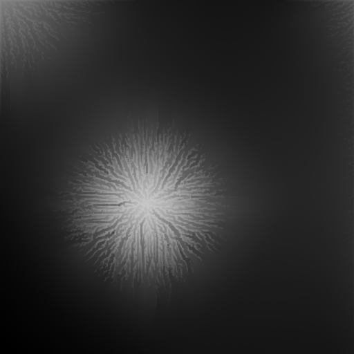

# Rainfall Terrain Erosion Simulation

## Motivation, Goals:
I've been interested in image processing for a while, so I wanted to build a C++ project that would allow me to work with (and process) image data. Terrain erosion is also something that I've worked on in the past using GAN's, so I wanted to try to do it computationally this time.

Additionally, I wanted to familiarize myself with CMake, CTest, and Github Actions. So an important part of this project is that in the `CMakeLists.txt` file, I wrote a code snippet that automatically creates a CTest instance for every `*.png` file in the `TestData` folder. Especially for a project with a visual output, this is very helpful, since it allows for test data to be changed on the fly, without the need for any code changes. Additionaly, this project uses Github Actions to automatically run the CTest suite after very push.

#### Technical details
I implemented the erosion process detailed in this [1969 paper](https://elibrary.asabe.org/abstract.asp??JID=3&AID=38945&CID=t1969&v=12&i=6&T=1), that outlines a method for eroding terrain in 1 dimension. I used this [blog post](https://ranmantaru.com/blog/2011/10/08/water-erosion-on-heightmap-terrain/) as inspiration for converting the method from 1D to 2D, and took a 'drop-by-drop' approach. By this I mean that eroding water droplets are randomly placed on the heightmap grid, and we iteratively erode the terrain by tracking the lifetimes of these droplets sequentially: first we perform the erosion using `droplet_1`, then `droplet_2`, and so on.

## Example Results - Inputs on the left, outputs on the right:
The erosion intensity in these results is intentionally high, to showcase the effects of running the program. A normal use case would use a less intense erosion level, for a more subtle effect. The results below are achieved with a simulation density of 10 droplets per heightmap pixel. For both images, the simulation time was 57 seconds on an intel 10750H processor.

  
&nbsp; &nbsp; &nbsp; &nbsp;
  

  
&nbsp; &nbsp; &nbsp; &nbsp;
  

### References
[Mathematical Simulation of the Process of Soil Erosion by Water](https://elibrary.asabe.org/abstract.asp??JID=3&AID=38945&CID=t1969&v=12&i=6&T=1)

[Water Erosion On Heightmap Terrain](https://ranmantaru.com/blog/2011/10/08/water-erosion-on-heightmap-terrain/)
